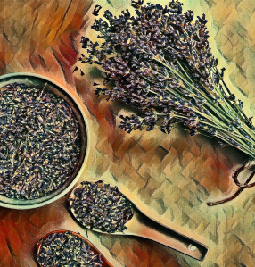

● Definición de la temática del e-commerce:

Venta relacionada a productos de lavanda, con posibilidad de visitas al campo de lavanda y el proceso de elaboración de ellos.

● Inventar una historia de la página:

Siempre Lavanda- El Proyecto de Lavanda, somos una empresa dedicada al cultivo, producción, reproducción y comercialización de la flor de lavanda; así como a la extracción de su aceite esencial utilizada en nuestros productos de origen natural, obteniendo un equilibrio entre cuerpo, alma y espíritu.

● Público objetivo:

e-comerce de productos de lavanda, orientado a público en general.

● Tipografía Principal:

font-family: 'Poppins', sans-serif;

● Paleta de colores:
<<<<<<< HEAD
=======
ECA3F5
FDBAF8
B0EFEB
EDFFA9

FCE2DB
FF8FB1
B270A2
7A4495

513252
7A4069
CA4E79
FFC18E
>>>>>>> a1edc53 (todo junto)

#B519DF
#8E19DF
#DF19D6
#1ECF18

● Creación de logo:

